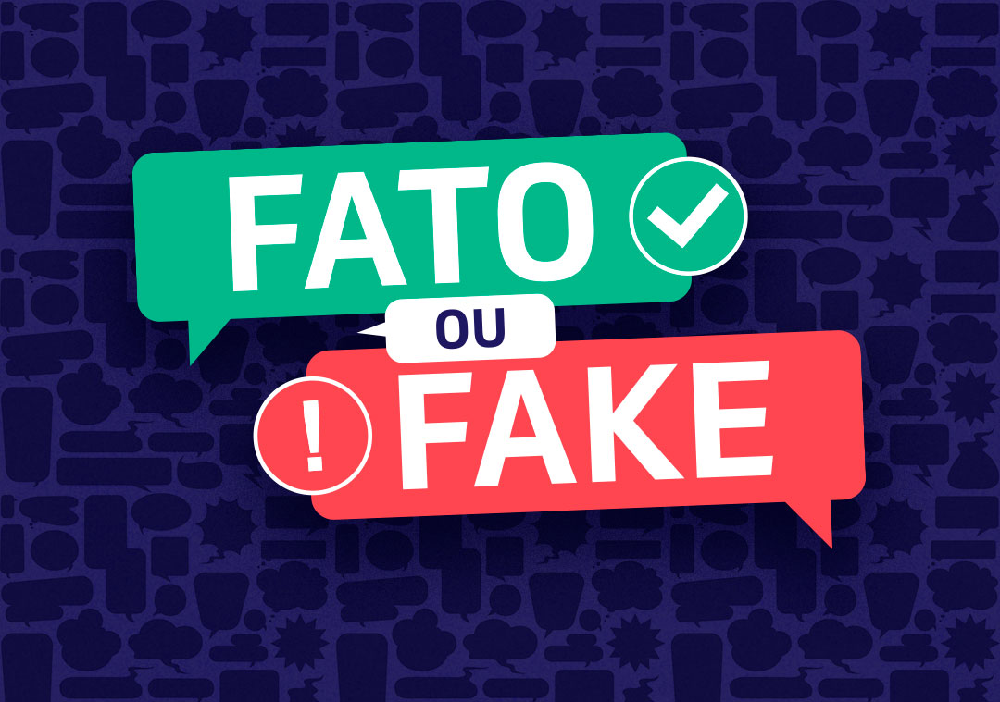

# Fato ou Fake?   Vamos Analisar as Informações Eleitorais de 2022 com Python?

Trago hoje pra você um post bem interessante!  Não sei se você sabe mais no dia 16/08/2022 iniciou-se oficialmente a campanha eleitoral de 2022.  Acredito que você tenha observado também que os veículos de comunicação (jornais e internet) estão divulgando diariamente estatísticas baseadas nas candidaturas.